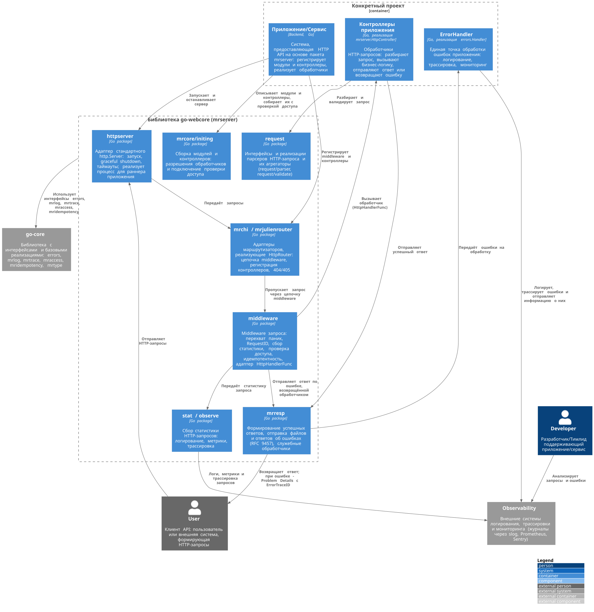

[Назад](../README.md)
---

# Пакет mrserver

## Общие сведения
Пакет содержит HTTP-инфраструктуру для построения API web сервисов: интерфейсы маршрутизатора,
контроллеров и обработчиков, middleware, разбор запросов, формирование ответов и ответов об ошибках,
сбор статистики запросов. Сам пакет `mrserver` определяет только интерфейсы и общие типы,
а конкретные сторонние библиотеки подключаются через адаптеры в подпакетах
(`mrchi`, `mrjulienrouter`, `mrrscors`, `mrprometheus`), поэтому их можно заменять в проектах.
Интерфейсы ошибок, логгера, трассировки, контроля доступа и идемпотентности
находятся в библиотеке [`go-core`](https://github.com/mondegor/go-core).

### Ключевые решения
- `HttpHandlerFunc` в отличие от `http.HandlerFunc` возвращает `error`: обработчик не формирует
  ответ об ошибке сам, ошибку централизованно обрабатывает `middleware.HandlerAdapter`,
  передавая её в `ErrorResponseSender` (подробнее о видах ошибок см. [go-core/errors](https://github.com/mondegor/go-core/blob/master/errors/README.md));
- Контроллер (`HttpController`) — это логическая группа обработчиков (`HttpHandler`), обычно связанных
  с одной сущностью. Каждый обработчик описывается методом, URL, разрешением (`Permission`) и функцией;
- Контроллеры объединяются в модули (`initing.HttpModule`), модули — в группы доступа
  (`mraccess.ActionGroup` с привилегией и базовым путём). Разрешение обработчика наследуется
  от контроллера, а контроллера — от модуля;
- Middleware, зарегистрированные через `HttpRouter.RegisterMiddleware(m1, m2, m3)`, выполняются
  в порядке перечисления: `m1(m2(m3(router)))`, т.е. первый в списке — самый внешний;
- Шаблонная переменная `VarRestOfURL` обозначает остаток пути в URL, адаптер маршрутизатора
  преобразует её в формат конкретной библиотеки;

### Проверка доступа к обработчикам
Проверка подключается операцией `initing.WithCheckAccessMiddleware` и зависит от сочетания
привилегии группы и разрешения обработчика:

| Привилегия группы | Разрешение обработчика | Действия                                      | Ошибки доступа  | Пользователь |
|-------------------|------------------------|-----------------------------------------------|-----------------|--------------|
| public            | everyone               | удаление внутренних заголовков                | нет             | нет          |
| public            | guest-only             | проверка токена, удаление внутренних заголовков | если есть: 403 | нет          |
| public            | any-user               | проверка токена (аутентификация)              | 401             | да           |
| public            | {permission}           | проверка токена/разрешения                    | 401, 403        | да           |
| {privilege}       | everyone               | проверка токена/привилегии                    | 401, 403        | да           |
| {privilege}       | guest-only             | предупреждение в лог                          | 403             | —            |
| {privilege}       | any-user               | проверка токена/привилегии (аутентификация)   | 401, 403        | да           |
| {privilege}       | {permission}           | проверка токена/привилегии/разрешения         | 401, 403        | да           |

Внутренние заголовки (`X-Internal-*`) устанавливает только сервер после проверки доступа,
поэтому там, где пользователь не определяется, значения, подставленные клиентом, удаляются.

Незарегистрированное разрешение (не указано в конфиге или не связано ни с одной ролью)
приводит к предупреждению в логе и ответу 403 для этого обработчика.

Служебные разрешения `everyone` и `any-user` передаются в `systemPermissions` провайдера ролей
(например, `filestorage.NewPermsProvider` из go-core) и поэтому есть у любого пользователя:
`any-user` означает любого авторизованного пользователя. Если их не передать, они считаются
незарегистрированными, и обработчики с ними отвечают 403.

Если `UserProvider` не задан, при инициализации в лог пишется ошибка, а все обработчики группы,
которым требуется пользователь, отвечают 401. Обработчики public + everyone/guest-only работают
как обычно, а privilege + guest-only и незарегистрированное разрешение по-прежнему дают
предупреждение в логе и ответ 403.

## Жизненный цикл HTTP-запроса
1. [httpserver.Adapter](httpserver/server_adapter.go) принимает запрос и передаёт его маршрутизатору;
2. `RouterAdapter.ServeHTTP` ([mrchi](mrchi/router_adapter.go), [mrjulienrouter](mrjulienrouter/router_adapter.go))
   пропускает запрос через цепочку middleware, например: `RequestIDHandler` → `ObserverHandler`
   → `RecoverHandler` → `mrrscors.Middleware` (порядок и набор выбирает приложение);
   `ObserverHandler` должен располагаться снаружи `RecoverHandler`, иначе запрос, завершившийся
   паникой, попадёт в статистику со статусом 200 (ответ 500 будет записан уже после сбора статистики);
3. Маршрутизатор находит обработчик; если маршрут или метод не найден, вызываются обработчики
   404/405 (например, `mrresp.HandlerGetNotFoundAsJSON`, `mrresp.HandlerGetMethodNotAllowedAsJSON`);
4. `middleware.HandlerAdapter` вызывает `HttpHandlerFunc`, предварительно обёрнутую на этапе
   инициализации проверкой доступа (`CheckAccessHandler`, `ClearInternalHeadersHandler`)
   и, при необходимости, идемпотентностью (`IdempotencyHandler`);
5. Обработчик разбирает запрос парсерами (`request/validate`, `request/parser`), вызывает бизнес-логику
   и отправляет ответ через `ResponseSender` / `FileResponseSender`;
6. Если обработчик вернул ошибку, `HandlerAdapter` передаёт её в `ErrorResponseSender.SendError`:
   - все ошибки, включая пользовательские, передаются в `errors.Handler` (логирование, трассировка);
   - пользовательские ошибки (`CustomError`, `CustomListError` вида user) — ответ 400 со списком
     локализованных `ErrorAttribute`;
   - для остальных ошибок HTTP-статус определяет `ErrorStatusMapper`: если это 400, ответ содержит
     один локализованный `ErrorAttribute`, иначе формируется в формате RFC 9457 (Problem Details)
     с `ErrorTraceID`;
7. При панике `RecoverHandler` логирует её со стеком вызовов (в debug-режиме — только в stderr,
   минуя логгер) и отдаёт ответ 500;
8. По завершении `ObserverHandler` передаёт статистику запроса в `RequestStat`
   (логирование, метрики, трассировка).

## Подсистемы пакета

### Маршрутизация и сборка обработчиков
Приложение описывает модули и контроллеры, собирает их с нужными разрешениями и проверкой доступа,
регистрирует в маршрутизаторе и передаёт маршрутизатор HTTP-серверу.

- [HttpRouter, HttpController, HttpHandler, HttpHandlerFunc](router.go) - интерфейсы маршрутизатора,
  контроллера и описание обработчика;
- [RouterAdapter для go-chi/chi](mrchi/router_adapter.go) и [URLPathParam](mrchi/url_path_param.go);
- [RouterAdapter для julienschmidt/httprouter](mrjulienrouter/router_adapter.go) и [URLPathParam](mrjulienrouter/url_path_param.go);
- [HandlerAdapter](middleware/handler_adapter.go) - адаптер `HttpHandlerFunc` к `http.HandlerFunc`
  с передачей ошибки в `ErrorResponseSender`;
- [httpserver.Adapter](httpserver/server_adapter.go) и [его опции](httpserver/server_options.go) - запуск
  и корректная остановка HTTP-сервера;
- [HttpModule, HttpController, CreateHttpControllers](../mrcore/initing/http_module.go) - описание
  и создание модулей и контроллеров;
- [PrepareHttpController](../mrcore/initing/http_controller.go) - применение операций к обработчикам контроллера;
- [WithPermission, WithCheckAccessMiddleware](../mrcore/initing/http_handler.go) - операции установки
  разрешения и подключения проверки доступа;

### Middleware
Middleware уровня маршрутизатора (`func(next http.Handler) http.Handler`) регистрируются через
`RegisterMiddleware`, middleware уровня обработчика (`func(next HttpHandlerFunc) HttpHandlerFunc`)
подключаются к отдельным обработчикам на этапе инициализации.

- [RecoverHandler](middleware/recover_handler.go) - перехват паник;
- [RequestIDHandler](middleware/request_id_handler.go) - генерация RequestID и приём CorrelationID;
- [ObserverHandler](middleware/observer_handler.go) - сбор статистики и трассировка запросов;
- [mrrscors.Middleware](mrrscors/cors_middleware.go) - CORS на основе `rs/cors`;
- [CheckAccessHandler](middleware/check_access_handler.go) - проверка доступа пользователя
  (через `mraccess.UserProvider`), данные пользователя передаются далее во внутренних заголовках;
- [ClearInternalHeadersHandler](middleware/clear_internal_headers_handler.go) - удаление подставленных клиентом внутренних заголовков,
  которые устанавливает `CheckAccessHandler` (public + everyone, public + guest-only);
- [IdempotencyHandler](middleware/idempotency_handler.go) - идемпотентность запросов
  (через `mridempotency.Provider`) и [CacheableResponseWriter](response_cacheable.go);
- [Заголовки запросов и ответов](header_keys.go);

### Разбор HTTP-запроса
Каждый парсер реализует узкий интерфейс `request.Parser*`, а агрегаторы из `request/validate`
объединяют их в типовые наборы, которые приложение встраивает в свои контроллеры.

- [Интерфейсы парсеров](request/parser.go);
- [AccessToken](request/authorization.go), [CorrelationID](request/correlation_id.go) - извлечение
  данных из заголовков;
- [Реализации парсеров](request/parser) - значения параметров пути и query, файлы и изображения,
  параметры списка (пагинация, сортировка, курсор), клиент, пользователь, локаль, часовой пояс,
  декодирование и валидация тела запроса;
- [Parser](request/validate/request_parser.go), [ListParser](request/validate/request_list_parser.go),
  [ContextParser](request/validate/request_context_parser.go) - агрегаторы парсеров;
- [JsonDecoder](mrjson/decoder.go) - декодирование JSON тела запроса;

### Формирование ответов и ошибок
- [ResponseEncoder, ResponseSender, FileResponseSender, ErrorResponseSender, ErrorStatusMapper](response.go) - интерфейсы;
- [NewHttpErrorStatusMapper](response.go) - маппер ошибок в HTTP-статусы с преднастроенными
  соответствиями (могут быть переопределены):
  - `ErrHttpClientUnauthorized` → 401;
  - `ErrHttpAccessForbidden`, `ErrAccessForbidden` → 403;
  - `ErrHttpResourceNotFound`, `ErrRecordNotFound` → 404;
  - `ErrRecordVersionConflict` → 409;
  - `ErrHttpRequestParseData` → 422;
  - `ErrHttpTooManyRequests` → 429;
  - `ErrNotImplemented` → 501;
  - пользовательские ошибки с кодом, которого нет в соответствиях → 400;
  - системные ошибки → 503, внутренние ошибки → 500;
  - ошибки без вида (без метода `Kind()`, т.е. необработанные разработчиком) → `unexpectedStatus`
    (по умолчанию 500);
- [Sender](mrresp/sender.go) и [FileSender](mrresp/sender_file.go) - отправка успешных ответов и файлов;
- [ErrorSender](mrresp/sender_error.go) и [модели ответов об ошибках](mrresp/error_model.go);
- [Обработчики ошибок 404/405/500](mrresp/handler_errors.go), [liveness/readiness](mrresp/handlers.go),
  [информация о системе](mrresp/handler_system_info.go);
- [JsonEncoder](mrjson/encoder.go) - кодирование ответов в JSON;

### Статистика HTTP-запросов
- [RequestStat](observe.go), [RequestContainer](request_container.go), [RequestObserve](request_observe.go) - интерфейсы
  получателей статистики и контейнер для подключения нескольких получателей;
- [RequestReader](observe/request_reader.go), [ResponseWriter](observe/response_writer.go) - обёртки
  запроса и ответа для сбора статистики;
- [RequestLogger](stat/request_logger.go), [RequestMetrics](stat/request_metrics.go),
  [RequestTracer](stat/request_tracer.go) - получатели статистики;
- [ObserveRequest](mrprometheus/observe_request.go) - метрики HTTP-запросов для Prometheus
  (готовые дашборды в [grafana-dashboards](../grafana-dashboards));

### Верхнеуровневая архитектура обработки HTTP-запросов

## Документация
- [C4 компоненты подсистем пакета](../docs/packages/README.md);
- [Каталог C4 элементов](../docs/components/README.md);
- [C4 диаграммы](../docs/diagrams/README.md);
